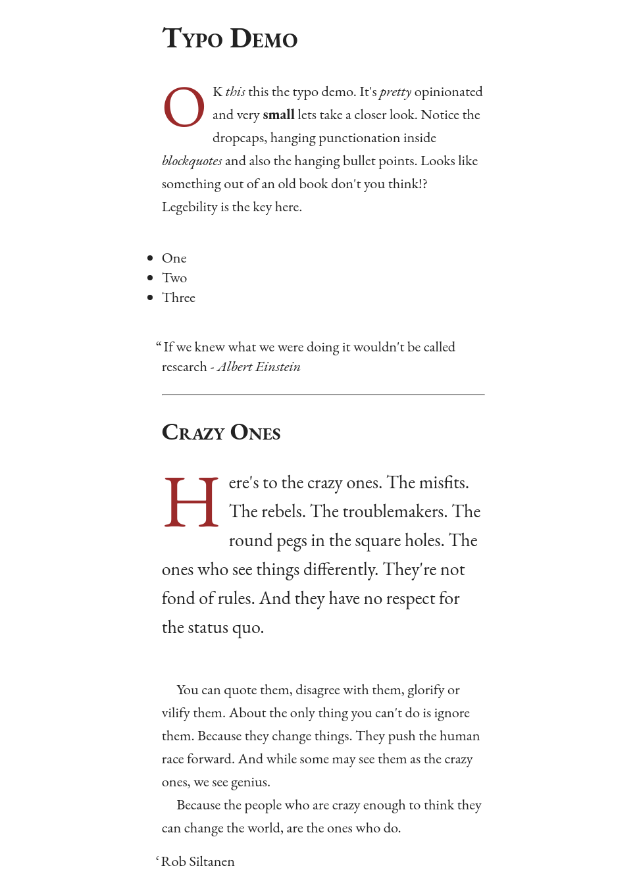

# Typo

A tiny little typography framework that targets your article tags.



**Changing the font?**

Just change the typeface inside the `typo.scss`. You will need to change the google
webfont inside the index.html also for the demo to change.

## Prerequisites

* Docker Community Edition - https://www.docker.com/community-edition
* Make - https://www.gnu.org/software/make/
* Python3 / http.server (only used to preview the build)

## Release - Build the latest version ready for release

```
make release
```

## Serve - Browse the project

```
make serve
```

*Browse to localhost:8000*
